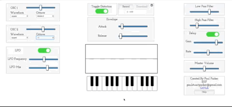
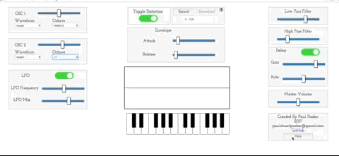

# waveShaper

WaveShaper is a fully functional digital synthesizer built in javascript.
Check out the live version [Here](https://paulstuartparker.github.io/waveShaper/ "here")

## Implementation

waveShaper makes use of the web audio api, common audio dsp techniques, and an organized audio graph for the routing.
There are two oscillators which generate the signal, as well as a low-frequency oscillator which generates a sine wave and modulates volume 
based on another oscillators frequency.  

The signal is then processed through various audio nodes and effects, and ultimately routed to the speakers as well as an audio
analyser node, which generates the waveform display with the use of a method called getByteTimeData and the canvas API. 

Since the amount of Hz between notes increases exponentially as pitch increases (see image below), the Low Pass Filter and High Pass Filter feature logarithmically scaled sliders, ensuring that the slider action matches our perception of frequency, providing a better and more intuitave user experience.


Code for scaled sliders: 
```ruby
lpf.frequency.value = 22050;
hpf.frequency.value = 5;
hpf.Q = 2;
lpf.Q = 2;
lpf.connect(hpf);
hpf.connect(preDist);

function logSlider(val, minL, maxL) {
  let min = 0;
  let max = 100;
  let minLval = Math.log(minL);
  let maxLval = Math.log(maxL);
  let scale = (maxLval - minLval) / (max - min);
  return Math.exp((val - min) * scale + minLval);
}


lpfFreq.addEventListener('input', function() {
  lpf.frequency.value = logSlider(parseInt(lpfFreq.value), 40, 22050);
});

hpfFreq.addEventListener('input', function() {
  hpf.frequency.value = logSlider(parseInt(hpfFreq.value), 10, 22050);
});
```

The layout follows the signal flow of the synthesizer from the left of the page to the right. The signal starts at the  oscillators which generate a wave, which is then routed through the filters, and finally to the speakers and waveform display.



I also implemented a help feature, allowing users to hover their mouse over a component's title if they want more information 
about how to use it.



This project uses the library  [querty hancock] for the keyboard, and maps the output from the user keypress in Hz to a new audio oscillator.


